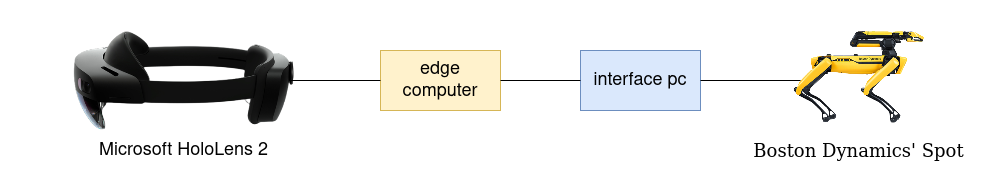

# Boston Dynamics Spot with Augmented Reality

## Description

See the camera livestreams of a Boston Dynamics robot dog Spot on holographic screens inside a Microsoft HoloLens 2. 
Using a dynamic requesting scheme to improve the framerate in the users field of view.

## install instruction
### interface pc
- use ubuntu 18.04
- Follow [Spot SDK](https://dev.bostondynamics.com/) to install the boston dynamics python library
- install these additional python librarys: numpy, opencv, threading
- copy the [spot_cam_server.py](src/python/spot_cam_server.py) to interface pc

### edge computer
- use windows 10
- install unity 
- load load the project adaptive_videostreaming from [unity](src/unity/) into Unity
- you can find the unity scripts [here](src/unity/adaptive_videostreaming/Assets/Scripts/)

## important
Advice:
- always start the Linux Computer with the Python Script **Before** you start the Unity Application

## Setup



## Getting Started
start every device and connect everything as it is shown in the setup graphic

### Hololens
- [first usage Information](https://docs.microsoft.com/en-us/hololens/hololens2-setup)
- [daily usage Information](https://docs.microsoft.com/en-us/hololens/holographic-home)
- push Power button
- put Hololens on
- important gestures: 
    - start: 
        - Rotate the wrist so that you can see the palm of the hand
        - click with your other Hand on the appearing Start Symbol
    - click:
        - move your index finger to the Button you would like click
    - move program: 
        - grab with thumb and index finger the programs bar to pull it to an other place
- Plug in Lan via LAN to USB type C adapter or connect wireless
    - [connect Hololens](https://github.com/MicrosoftDocs/Hololens/blob/public/hololens/hololens-network.md)
- start Holographic Remoting App
    - start gesture, click on HoloRemoting App

### Boston Dynamics Spot
[Spot Doc](https://dev.bostondynamics.com/)
- Press Power Button of Spot long
- wait till Spot is creating AP
- connect with interface pc to accespoint

### interface PC
Connect XBox Controller to USB-Port of Linux Computer

log into Linux Computer with SSH:

start the python script
```bash
# start XBox Control and livestream from all Cameras
sudo -E python3 main.py --stream front_left front_right left right arm back --quality 25 --control
```

Additional commands for advanced usage
```bash
# start only XBox Control
sudo -E python3 main.py --control

# start only livestreams
sudo -E python3 main.py --stream front_left front_right left right arm back --quality 25

# start simulation 
sudo -E python3 main.py --stream front_left front_right left right arm back --quality 25 --simulation

# additional Arguments
--ip-hololens 0.0.0.0       # change IP of Hololens Computer, default: 192.168.2.4
--ip-spot 0.0.0.0           # change IP of BD Spot, default: 192.168.2.6
--quality 25                # jpg reduced to quality of 25 of 100
--control                   # enable/disable XBox Controller
--stream                    # add streams which should transmitted
--username                  # Spot username
--password                  # Spot password

# more Arguments
python3 main.py --help
```

Gesture Control is only possible if Spot is in mode standing

### Windows Computer
- start Unity Hub from Desktop or Start
- click on `hololens_handtracking` Project to open Project
- set the IP of the Hololens for Holographic Remoting (can be skipped if already done)
    - click in the Toolbar on Mixed Reality
    - Remoting/Holographoc Remoting for Play Mode
    - set IP Address at Remote Host Name
- start the Holographic Remoting to the Hololens 2 with a click on the Play Button
- Launch Program to a specific position
    - Look into the direction where the Program should be launched and stop the Holographic Remoting with a click on the play button
    - start Holographic Remoting again with a click on the play button
